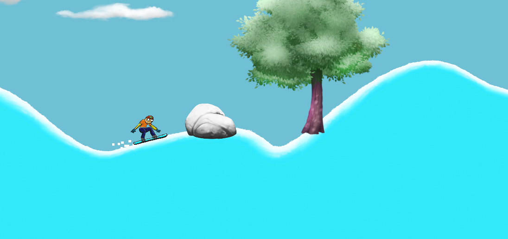

# Snow-Boarder

This 2D Game was created in Unity engine according to the course on Udemy.com

In this game, it is possible to move around the map using the arrow keys on the keyboard. The main goal of the game is to reach the end, while the player must not touch the ground with any other part than the snowboard (he must not fall). In the game, sounds and effects of moving through the snow have been added. The up arrow on the keyboard makes the player speed up. Collisions are not turned on.

## Screenshoot

